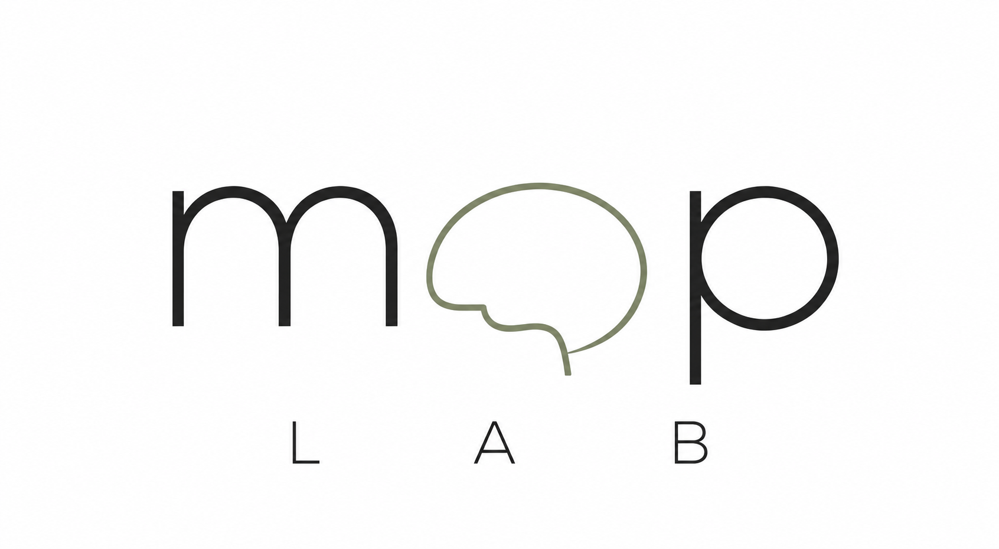

## Mechanisms and Prediction of Psychosis Lab

### Understanding the brain to predict and prevent psychosis.

The MAP Lab investigates the biological and environmental mechanisms underlying psychosis. We integrate neuroimaging, blood biomarkers, environmental risk factors and computational modelling to understand why psychosis develops and how it can be predicted earlier.

## Our Research

MAP Lab is based within the Division of Psychiatry at University College London (UCL).

### Brain Imaging

Advanced MRI and spectroscopy to understand brain structure and chemistry.

### Environment

How childhood adversity and the social environment influence brain development.

### Blood Biomarkers

Inflammation, immune function and molecular markers associated with psychosis.

### Prediction

Machine learning approaches for identifying individuals at greatest risk.

## Latest News

- Ethics approval obtained for our new 7T neuroimaging study.
- Recruiting participants for the 7T Glu-MAP study.

