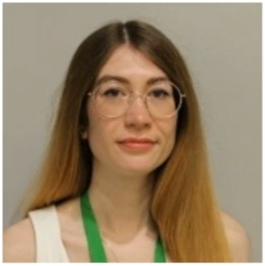
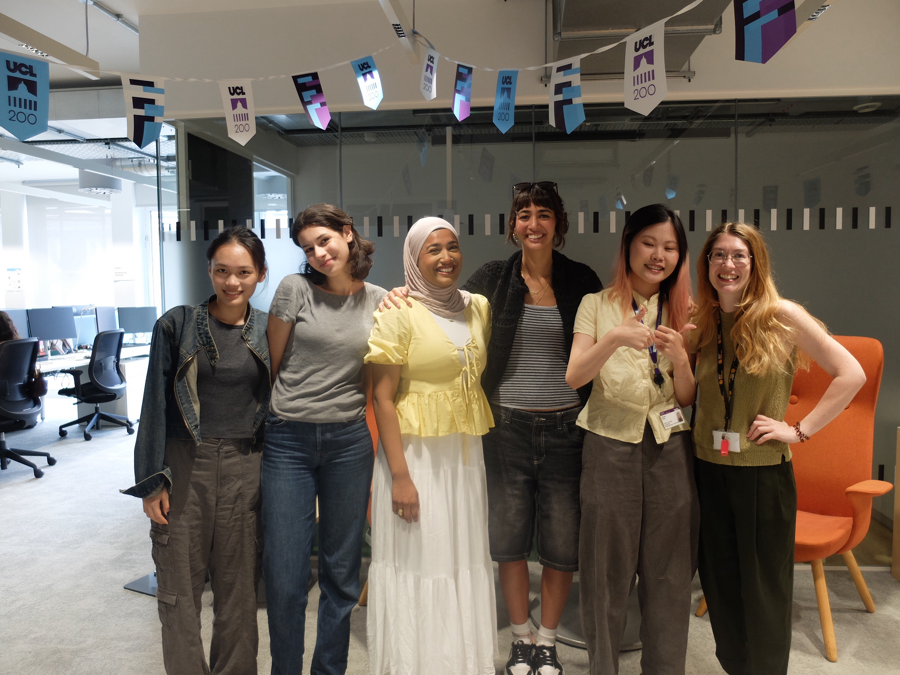

# People

## PI

### Dr Kate Merritt

Lecturer in Human Neuroscience  
University College London

Research interests:

- Psychosis
- Neuroimaging
- Brain glutamate
- Environmental risk
- Clinical Trials
- Inflammation
- Machine learning

  {width=250px}

---

## Students

{width=250px}

---

## Collaborators

Anthony David
Alice Egerton
Matthew Kempton
Rick Adams
Daniel Hauke
Rob McCutcheon
Philip McGuire
Katherine Beck
Benson Ku
Jennifer Dykxhoorn
Camilo de la Fuente Sandoval
Joseph Hayes
Andy McQuillin
Paola Dazzan
Dominic Oliver
Sharon Eager
Barbara Dymerska
Robin Murray